# Infrastructure as Code & GitOps Demo Project

A modern DevOps infrastructure project demonstrating IaC, GitOps, monitoring, and auto-scaling capabilities using AWS EKS.

## Architecture Overview

- AWS EKS Cluster managed with Terraform
- GitOps deployment using ArgoCD
- Monitoring stack with Prometheus and Grafana
- Horizontal Pod Autoscaling
- Automated alerting system with Slack integration



## Technologies Used

- **Infrastructure as Code**: Terraform v1.7+
- **Container Orchestration**: Kubernetes (EKS) v1.27+
- **GitOps**: ArgoCD v2.8+
- **Monitoring**: Prometheus & Grafana v10.0+
- **Container Registry**: Docker Hub
- **Cloud Provider**: AWS
- **Demo Application**: Node.js v16+
- **Alerting**: Slack integration

## Project Structure

```
infrastructure-portfolio/
├── application/          # Demo application code
│   ├── src/             # Application source code
│   └── Dockerfile       # Container image definition
├── cluster-setup/       # Cluster-wide components
│   └── metrics-server.yaml
├── kubernetes/         # Kubernetes manifests
│   ├── base/          # Base configurations
│   └── overlays/      # Environment-specific configs
└── terraform/        # Infrastructure as Code
    ├── modules/     # Reusable Terraform modules
    └── environments/# Environment configurations
```

## Prerequisites

### Required Tools
- AWS CLI v2.x
- Docker Desktop with Kubernetes enabled
- kubectl v1.27+
- Terraform v1.7+
- Git
- Slack workspace with admin access

### AWS Configuration
1. Create an AWS account (free tier eligible)
2. Create an IAM user with programmatic access
3. Required IAM permissions:
   - AmazonEKSClusterPolicy
   - AmazonEKSServicePolicy
   - Additional permissions for VPC and EC2

### Environment Variables
```bash
AWS_ACCESS_KEY_ID=your_access_key
AWS_SECRET_ACCESS_KEY=your_secret_key
AWS_DEFAULT_REGION=eu-central-1
```

## Detailed Setup Instructions

### 1. Infrastructure Setup
```bash
# Clone the repository
git clone https://github.com/Mete-cell/infrastructure-portfolio.git
cd infrastructure-portfolio

# Initialize Terraform
cd terraform/environments/dev
terraform init

# Review the infrastructure plan
terraform plan

# Apply the infrastructure
terraform apply
```

### 2. Configure kubectl
```bash
# Update kubeconfig for EKS
aws eks update-kubeconfig --region eu-central-1 --name dev-eks
```

### 3. Deploy ArgoCD
```bash
# Create ArgoCD namespace
kubectl create namespace argocd

# Deploy ArgoCD
kubectl apply -n argocd -f https://raw.githubusercontent.com/argoproj/argo-cd/stable/manifests/install.yaml

# Get the ArgoCD password
kubectl -n argocd get secret argocd-initial-admin-secret -o jsonpath="{.data.password}" | base64 -d

# Port forward for UI access
kubectl port-forward svc/argocd-server -n argocd 8080:443
```

### 4. Deploy Monitoring Stack
```bash
# Install Metrics Server
kubectl apply -f cluster-setup/metrics-server.yaml

# Install Prometheus & Grafana
helm repo add prometheus-community https://prometheus-community.github.io/helm-charts
helm install monitoring prometheus-community/kube-prometheus-stack --namespace monitoring --create-namespace
```

### 5. Configure Auto-Scaling
```bash
# Apply HPA configuration
kubectl apply -f kubernetes/base/hpa.yaml
```

### 6. Slack Integration Setup
1. Create a Slack App:
   - Go to https://api.slack.com/apps
   - Click "Create New App"
   - Choose "From scratch"
   - Name: "Grafana Alerts"
   - Select your workspace

2. Configure Webhook:
   - Click "Incoming Webhooks"
   - Activate Incoming Webhooks
   - Add New Webhook to Workspace
   - Select channel for alerts
   - Copy Webhook URL

3. Configure in Grafana:
   - Navigate to Alerting → Contact points
   - Add contact point
   - Type: Slack
   - Webhook URL: Your Slack webhook URL
   - Message template:
     ```
     *{{ .CommonLabels.alertname }}*
     ------------------------------
     Alert: Resource usage is high
     Status: {{ .Status }}
     Severity: High
     ```

## Development

### Local Development
```bash
# Build and run the demo app locally
cd application
npm install
npm start

# Build Docker image
docker build -t your-username/demo-app:v1 .
docker run -p 3000:3000 your-username/demo-app:v1
```

### Deployment Process
1. Make changes to the application code
2. Build and push new Docker image:
   ```bash
   docker build -t your-username/demo-app:v2 .
   docker push your-username/demo-app:v2
   ```
3. Update image tag in kubernetes/base/deployment.yaml
4. Commit and push changes
5. ArgoCD will automatically sync and deploy

## Monitoring & Management

### Accessing Dashboards
- Grafana: http://localhost:3000 (default credentials: admin/prom-operator)
- ArgoCD: https://localhost:8080 (credentials from setup step)

### Key Metrics
- CPU and Memory usage
- Request rate
- Error rate
- Pod scaling events

### Alerts Configuration
- CPU usage threshold: 50%
- Memory usage threshold: 70%
- Custom alert rules can be added via Grafana UI

### Alert Notifications
- Configured through Slack integration
- Real-time alerts for resource usage
- Scaling events notifications
- System health updates

## Troubleshooting

### Common Issues

1. **Terraform Apply Fails**
   - Check AWS credentials
   - Verify IAM permissions
   - Ensure VPC limits haven't been reached

2. **Pods Stuck in Pending**
   - Check node capacity:
     ```bash
     kubectl describe node
     ```
   - Verify resource requests/limits

3. **ArgoCD Sync Issues**
   - Check Git repository access
   - Verify kubernetes manifests
   - Check ArgoCD logs:
     ```bash
     kubectl logs -n argocd deploy/argocd-server
     ```

4. **HPA Not Scaling**
   - Verify metrics-server is running
   - Check HPA status:
     ```bash
     kubectl describe hpa demo-app-hpa
     ```
   - Verify resource metrics

5. **Slack Alerts Not Working**
   - Verify webhook URL
   - Check Grafana contact point configuration
   - Review alert rule configuration
   - Check Grafana logs for webhook errors

### Useful Commands
```bash
# Check pod status
kubectl get pods
kubectl describe pod <pod-name>

# View logs
kubectl logs <pod-name>

# Check HPA
kubectl get hpa
kubectl describe hpa

# Check metrics
kubectl top pods
kubectl top nodes
```

## Security Considerations

- Use AWS Security Groups for network isolation
- Enable RBAC for Kubernetes access control
- Regularly update container images
- Monitor and audit cluster access
- Use secrets management for sensitive data
- Secure Slack webhook URLs in Kubernetes secrets

## Contributing

1. Fork the repository
2. Create your feature branch
3. Commit your changes
4. Push to the branch
5. Create a new Pull Request

## License

This project is licensed under the MIT License - see the LICENSE file for details